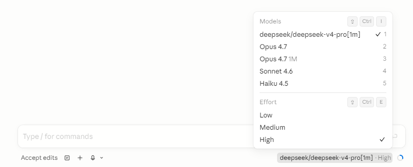

# deepclaude

Use Claude Code's autonomous agent loop with **DeepSeek V4 Pro**, **OpenRouter**, **DashScope**, **Kimi**, **MiMo**, or any Anthropic-compatible backend. Same UX, up to 50x cheaper.



## What this does

Claude Code is the best autonomous coding agent — but it costs $200/month with usage caps. DeepSeek V4 Pro scores 96.4% on LiveCodeBench and costs $0.87/M output tokens.

**deepclaude** swaps the brain while keeping the body:

```
Your terminal
  +-- Claude Code CLI (tool loop, file editing, bash, git - unchanged)
        +-- API calls -> DeepSeek V4 Pro ($0.87/M) instead of Anthropic ($15/M)
```

Everything works: file reading, editing, bash execution, subagent spawning, autonomous multi-step coding loops. The only difference is which model thinks.

## Quick start (2 minutes)

### 1. Get an API key

Sign up at any provider, add credit, copy your API key.

**DeepSeek** (default): [platform.deepseek.com](https://platform.deepseek.com)
**OpenRouter**: [openrouter.ai](https://openrouter.ai)
**Fireworks AI**: [fireworks.ai](https://fireworks.ai)
**DashScope**: [dashscope.aliyun.com](https://dashscope.aliyun.com)
**Kimi/Moonshot**: [moonshot.ai](https://moonshot.ai)
**MiMo/Xiaomi**: [xiaomimimo.com](https://xiaomimimo.com)

### 2. Set environment variables

Or use a `.env` file in the deepclaude directory (loaded automatically).

**Windows (PowerShell):**
```powershell
setx DEEPSEEK_API_KEY "sk-your-key-here"
```

**macOS/Linux:**
```bash
echo 'export DEEPSEEK_API_KEY="sk-your-key-here"' >> ~/.bashrc
source ~/.bashrc
```

### 3. Install

**Windows:**
```powershell
# Copy the script to a directory in your PATH
Copy-Item deepclaude.ps1 "$env:USERPROFILE\.local\bin\deepclaude.ps1"

# Or add the repo directory to PATH
setx PATH "$env:PATH;C:\path\to\deepclaude"
```

**macOS/Linux:**
```bash
chmod +x deepclaude.sh
sudo ln -s "$(pwd)/deepclaude.sh" /usr/local/bin/deepclaude
```

### 4. Use it

```bash
deepclaude                  # Launch Claude Code with DeepSeek V4 Pro
deepclaude --status         # Show available backends and keys
deepclaude --list           # List active proxy instances
deepclaude --backend or     # Use OpenRouter (cheapest, $0.44/M input)
deepclaude --backend fw     # Use Fireworks AI (fastest, US servers)
deepclaude --backend al     # Use DashScope (Alibaba Qwen)
deepclaude --backend km     # Use Kimi K2.6 (Moonshot)
deepclaude --backend mm     # Use MiMo V2.5 (Xiaomi)
deepclaude --backend anthropic  # Normal Claude Code (when you need Opus)
deepclaude --cost           # Show pricing comparison
deepclaude --benchmark      # Latency test across all providers
deepclaude --switch ds      # Switch backend mid-session (no restart)
deepclaude --switch or -p 3201  # Target specific proxy by port
```

## How it works

Claude Code reads these environment variables to determine where to send API calls:

| Variable | What it does |
|---|---|
| `ANTHROPIC_BASE_URL` | API endpoint (default: api.anthropic.com) |
| `ANTHROPIC_AUTH_TOKEN` | API key for the backend |
| `ANTHROPIC_DEFAULT_OPUS_MODEL` | Model name for Opus-tier tasks |
| `ANTHROPIC_DEFAULT_SONNET_MODEL` | Model name for Sonnet-tier tasks |
| `ANTHROPIC_DEFAULT_HAIKU_MODEL` | Model name for Haiku-tier (subagents) |
| `CLAUDE_CODE_SUBAGENT_MODEL` | Model for spawned subagents |

**deepclaude** sets these per-session (not permanently), launches Claude Code, then restores your original settings on exit.

## Supported backends

| Backend | Flag | Input/M | Output/M | Servers | Notes |
|---|---|---|---|---|---|
| **DeepSeek** (default) | `--backend ds` | $0.44 | $0.87 | China | Auto context caching (120x cheaper on repeat turns) |
| **OpenRouter** | `--backend or` | $0.44 | $0.87 | US | Cheapest, lowest latency from US/EU |
| **Fireworks AI** | `--backend fw` | $1.74 | $3.48 | US | Fastest inference |
| **DashScope** | `--backend al` | $0.55 | $1.65 | China | Alibaba Qwen3.6-plus |
| **Kimi K2.6** | `--backend km` | $0.40 | $1.90 | China | Moonshot AI |
| **MiMo V2.5** | `--backend mm` | $0.20 | $0.80 | Singapore | Xiaomi, cheapest option |
| **Anthropic** | `--backend anthropic` | $3.00 | $15.00 | US | Original Claude Opus (for hard problems) |

### Setup per backend

**DeepSeek** (default - just needs `DEEPSEEK_API_KEY`):
```bash
setx DEEPSEEK_API_KEY "sk-..."           # Windows
export DEEPSEEK_API_KEY="sk-..."         # macOS/Linux
```

**OpenRouter** (optional):
```bash
setx OPENROUTER_API_KEY "sk-or-..."      # Windows
export OPENROUTER_API_KEY="sk-or-..."    # macOS/Linux
```

**Fireworks AI** (optional):
```bash
setx FIREWORKS_API_KEY "fw_..."          # Windows
export FIREWORKS_API_KEY="fw_..."        # macOS/Linux
```

**DashScope** (optional):
```bash
setx DASHSCOPE_API_KEY "sk-sp-..."       # Windows
export DASHSCOPE_API_KEY="sk-sp-..."     # macOS/Linux
```

**Kimi K2.6** (optional):
```bash
setx KIMI_API_KEY "sk-..."               # Windows
export KIMI_API_KEY="sk-..."             # macOS/Linux
```

**MiMo V2.5** (optional):
```bash
setx MIMO_API_KEY "tp-..."               # Windows
export MIMO_API_KEY="tp-..."             # macOS/Linux
```

Or put all keys in a `.env` file in the deepclaude directory:
```
DEEPSEEK_API_KEY=sk-...
OPENROUTER_API_KEY=sk-or-...
FIREWORKS_API_KEY=fw_...
DASHSCOPE_API_KEY=sk-sp-...
KIMI_API_KEY=sk-...
MIMO_API_KEY=tp-...
CHEAPCLAUDE_DEFAULT_BACKEND=ds
```

## Cost comparison

| Usage level | Anthropic Max | deepclaude (DeepSeek) | Savings |
|---|---|---|---|
| Light (10 days/mo) | $200/mo (capped) | ~$20/mo | 90% |
| Heavy (25 days/mo) | $200/mo (capped) | ~$50/mo | 75% |
| With auto loops | $200/mo (capped) | ~$80/mo | 60% |

DeepSeek's automatic context caching makes agent loops extremely cheap - after the first request, the system prompt and file context are cached at $0.004/M (vs $0.44/M uncached).

## What works and what doesn't

### Works
- File reading, writing, editing (Read/Write/Edit tools)
- Bash/PowerShell execution
- Glob and Grep search
- Multi-step autonomous tool loops
- Subagent spawning
- Git operations
- Project initialization (`/init`)
- Thinking mode (enabled by default)

### Doesn't work or degraded
| Feature | Reason |
|---|---|
| Image/vision input | DeepSeek's Anthropic endpoint doesn't support images |
| Parallel tool use | Supported by DeepSeek (up to 128 per call), but Claude Code sends tools sequentially by default |
| MCP server tools | Not supported through compatibility layer |
| Prompt caching savings | DeepSeek has its own caching (automatic), but Anthropic's `cache_control` is ignored |

### Intelligence difference
- **Routine tasks** (80% of work): DeepSeek V4 Pro is comparable to Claude Opus
- **Complex reasoning** (20%): Claude Opus is stronger - switch with `--backend anthropic`

## Multi-session proxy management

Multiple deepclaude instances can run simultaneously without port conflicts. Each proxy auto-allocates an available port (3200-3220) and registers a state file in `$TMPDIR` (macOS/Linux) or `$TEMP` (Windows).

### List active proxies

```bash
deepclaude --list        # or: -l
```

Output:
```
  Active deepclaude Proxies
  ==========================

  :3200  pid=12345  mode=deepseek  requests=12
  :3201  pid=12346  mode=openrouter  requests=4
```

Shows port, PID, current backend mode, and request count. Stale state files from dead processes are cleaned automatically.

### Target a specific proxy

```bash
deepclaude --switch ds -p 3201   # or: -s ds --port 3201
```

Without `--port`, the CLI checks `ANTHROPIC_BASE_URL` first, then falls back to `3200`.

## Live switching (no restart)

Switch between backends **mid-session** - from inside Claude Code itself or from a separate terminal. No restart. Just type a slash command or use the CLI.

**In Claude Code terminal:**


**In Claude Code VS Code extension:**


### How it works

The proxy runs on `localhost` and intercepts all API calls. A control endpoint (`/_proxy/mode`) lets you switch the active backend instantly. The proxy handles:

- **Model name remapping**: Claude Opus → backend-equivalent model automatically
- **Thinking block stripping**: Foreign thinking blocks removed when switching back to Anthropic
- **Auth header swapping**: Bearer vs x-api-key per backend

```
Claude Code -> localhost:3200 (proxy)
                 |
                 +-- /_proxy/mode POST -> switch backend
                 +-- /_proxy/status GET -> current backend + uptime
                 +-- /_proxy/cost GET -> token usage + cost savings
                 |
                 +-- /v1/messages -> active backend (DeepSeek/OpenRouter/etc)
                 +-- everything else -> Anthropic (passthrough)
```

### Option 1: Slash commands (recommended)

Add these files to `~/.claude/commands/`:

**`deepseek.md`:**
```
Switch the model proxy to DeepSeek. Run this command silently and report the result:
curl -sX POST http://127.0.0.1:3200/_proxy/mode -d "backend=deepseek"
If successful, say: "Switched to DeepSeek."
```

**`anthropic.md`:**
```
Switch the model proxy back to Anthropic. Run this command silently and report the result:
curl -sX POST http://127.0.0.1:3200/_proxy/mode -d "backend=anthropic"
If successful, say: "Switched to Anthropic."
```

**`openrouter.md`:**
```
Switch the model proxy to OpenRouter. Run this command silently and report the result:
curl -sX POST http://127.0.0.1:3200/_proxy/mode -d "backend=openrouter"
If successful, say: "Switched to OpenRouter."
```

Then type `/deepseek`, `/anthropic`, or `/openrouter` in any Claude Code session to switch instantly.

### Option 2: CLI flag

```bash
deepclaude --switch deepseek    # or: ds, or, fw, al, km, mm, anthropic
deepclaude -s anthropic
deepclaude --switch or -p 3201  # target specific proxy
```

### Option 3: VS Code keyboard shortcuts

Add to `.vscode/tasks.json`:
```json
{
  "version": "2.0.0",
  "tasks": [
    {
      "label": "Proxy: Switch to DeepSeek",
      "type": "shell",
      "command": "Invoke-RestMethod -Uri http://127.0.0.1:3200/_proxy/mode -Method Post -Body 'backend=deepseek'",
      "presentation": { "reveal": "always" },
      "problemMatcher": []
    },
    {
      "label": "Proxy: Switch to Anthropic",
      "type": "shell",
      "command": "Invoke-RestMethod -Uri http://127.0.0.1:3200/_proxy/mode -Method Post -Body 'backend=anthropic'",
      "presentation": { "reveal": "always" },
      "problemMatcher": []
    }
  ]
}
```

Then bind in `keybindings.json`:
```json
{ "key": "ctrl+alt+d", "command": "workbench.action.tasks.runTask", "args": "Proxy: Switch to DeepSeek" },
{ "key": "ctrl+alt+a", "command": "workbench.action.tasks.runTask", "args": "Proxy: Switch to Anthropic" }
```

### Cost tracking

The proxy tracks token usage and calculates savings vs Anthropic pricing:

```bash
curl -s http://127.0.0.1:3200/_proxy/cost
```

Returns:
```json
{
  "backends": {
    "deepseek": {
      "input_tokens": 125000,
      "output_tokens": 45000,
      "requests": 12,
      "cost": 0.0941,
      "anthropic_equivalent": 1.05
    }
  },
  "total_cost": 0.0941,
  "anthropic_equivalent": 1.05,
  "savings": 0.9559
}
```

## Standalone proxy

Run the proxy independently (useful for multiple sessions or custom setups):

```bash
node proxy/start-proxy.js --mode deepseek --port 3201
```

Or programmatically:
```javascript
import { startModelProxy } from './model-proxy.js';

const proxy = await startModelProxy({
    targetUrl: 'https://api.deepseek.com/anthropic',
    apiKey: process.env.DEEPSEEK_API_KEY,
});

console.log(`Proxy on port ${proxy.port}`);

// Set env vars for claude:
// ANTHROPIC_BASE_URL=http://127.0.0.1:${proxy.port}
// ANTHROPIC_DEFAULT_OPUS_MODEL=deepseek-v4-pro
// (do NOT set ANTHROPIC_AUTH_TOKEN — OAuth handles bridge auth)

// When done:
proxy.close();
```

## VS Code / Cursor integration

Add terminal profiles so you can launch deepclaude from the IDE:

**Settings > JSON:**
```json
{
  "terminal.integrated.profiles.windows": {
    "DeepSeek Agent": {
      "path": "powershell.exe",
      "args": ["-ExecutionPolicy", "Bypass", "-NoExit", "-File", "C:\\path\\to\\deepclaude.ps1"]
    }
  }
}
```

Or on macOS/Linux:
```json
{
  "terminal.integrated.profiles.linux": {
    "DeepSeek Agent": {
      "path": "/usr/local/bin/deepclaude"
    }
  }
}
```

## Remote control (`--remote`)

Open a Claude Code session in any browser - with DeepSeek as the brain:

```bash
deepclaude --remote                # Remote control + DeepSeek
deepclaude --remote -b or          # Remote control + OpenRouter
deepclaude --remote -b anthropic   # Remote control + Anthropic (normal)
```

This prints a `https://claude.ai/code/session_...` URL you can open on your phone, tablet, or any browser.

### How it works

Remote control needs Anthropic's bridge for the WebSocket connection, but model calls can go elsewhere. deepclaude starts a local proxy that splits the traffic:

```
claude remote-control
  +-- Bridge WebSocket -> wss://bridge.claudeusercontent.com (Anthropic, hardcoded)
  +-- Model API calls  -> http://localhost:3200 (proxy)
                            +-- /v1/messages -> DeepSeek ($0.87/M)
                            +-- everything else -> Anthropic (passthrough)
```

### Prerequisites
- Must be logged into Claude Code: `claude auth login`
- Must have a claude.ai subscription (the bridge is Anthropic infrastructure)
- Node.js 18+ (for the proxy)

The proxy starts automatically and stops when the session ends. See [proxy/README.md](proxy/README.md) for technical details.

## License

MIT
